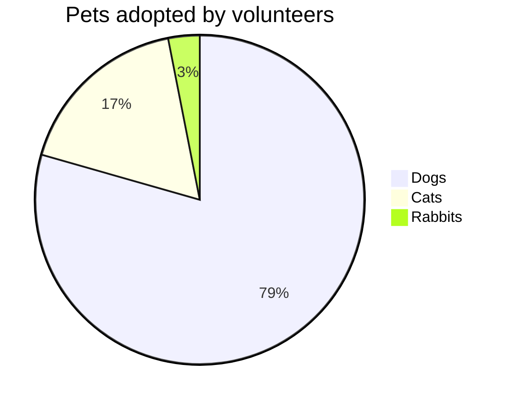
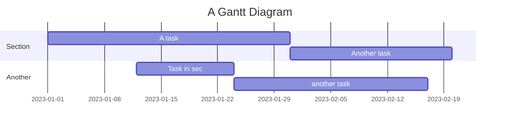

# Example Markdown with Mermaid

This is a markdown file with embedded mermaid diagrams.

## First Diagram

```mermaid
pie title Pets adopted by volunteers
    "Dogs" : 386
    "Cats" : 85
    "Rabbits" : 15
```

## Second Diagram

```mermaid
gantt
    title A Gantt Diagram
    dateFormat  YYYY-MM-DD
    section Section
    A task           :a1, 2023-01-01, 30d
    Another task     :after a1, 20d
    section Another
    Task in sec      :2023-01-12, 12d
    another task     :24d
```
        